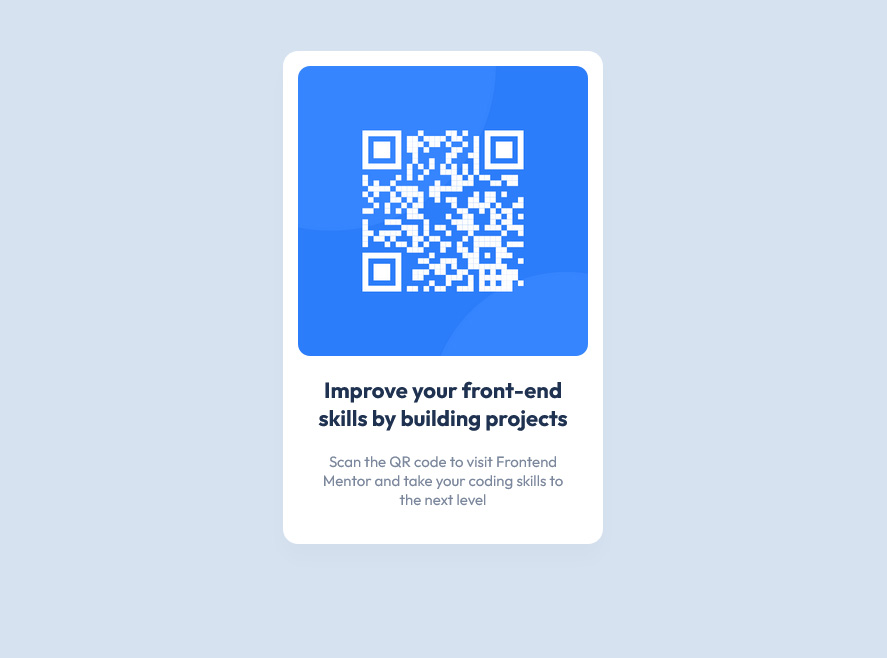

# Frontend Mentor - QR code component solution

This is a solution to the [QR code component challenge on Frontend Mentor](https://www.frontendmentor.io/challenges/qr-code-component-iux_sIO_H). Frontend Mentor challenges help you improve your coding skills by building realistic projects.

## Table of contents

- [Overview](#overview)
  - [Screenshot](#screenshot)
  - [Links](#links)
- [My process](#my-process)
  - [Built with](#built-with)
  - [What I learned](#what-i-learned)
  - [Continued development](#continued-development)
- [Author](#author)

## Overview

### Screenshot

### Links

- Solution URL: [Solution URL](https://github.com/RainOfTea/QR-code-component-Frontend-Mentor)
- Live Site URL: [Live site URL](https://master--animated-lamington-454263.netlify.app/)

## My process

### Built with

- HTML5 markup
- CSS
- Flexbox
- Desktop-first workflow

### What I learned

My first public project helped me practice some basic, but very important HTML & CSS concepts, such as proper markup, using descriptive class names and setting the proper width of components.

### Continued development

Component sizing is still a skill that I need to practice.

## Author

- Frontend Mentor - [@RainOfTea](https://www.frontendmentor.io/profile/RainOfTea)
